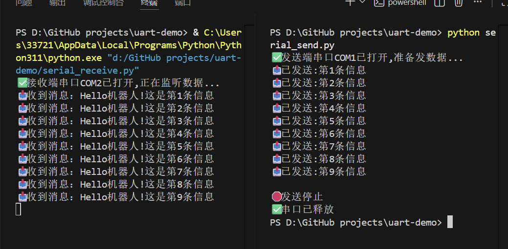

这是我在大学学习电子信息时，写的第一个python串口通信练手项目，用来熟悉UART收发和GitHub开源流程
# UART Serial Communication Demo

一个基于 Python 的串口通信入门演示项目，使用虚拟串口对实现收发数据的完整链路。

## 功能特性
- 发送端：循环发送带计数的测试消息
- 接收端：实时监听并打印收到的消息
- 支持优雅停止（Ctrl+C），自动释放串口资源

## 环境准备
1. 安装 Python 3.7+
2. 安装虚拟串口工具（如 VSPE）
3. 创建虚拟串口对（如 COM1 <-> COM2）

## 快速开始
1. 克隆项目
```bash
git clone https://github.com/yy0518-MagYon/uart-demo.git
cd uart-demo

## 结果图

